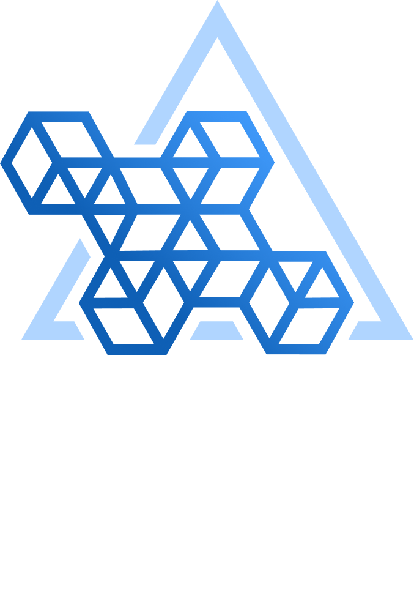
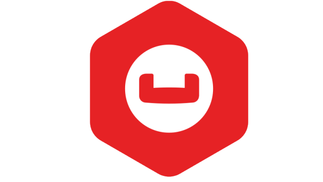
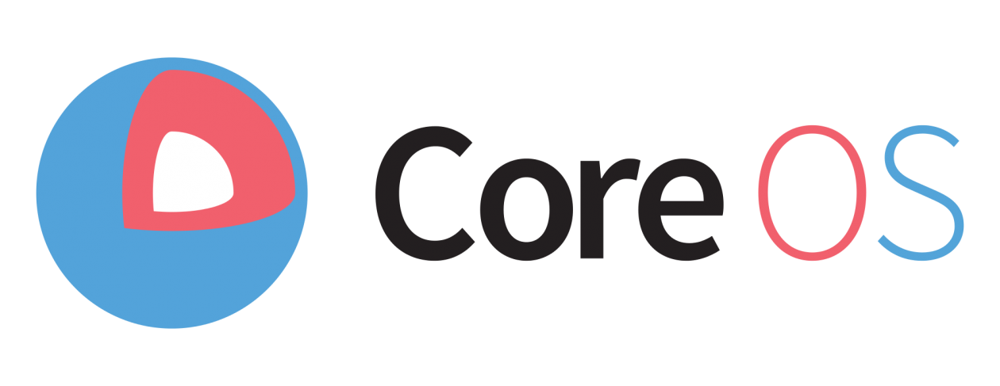

# 🗂️ Timeline for Databases on Kubernetes

Welcome to the **Evolution of Databases on Kubernetes timeline!** Here, we showcase important moments in the journey of running databases on Kubernetes. From the first days of using popular databases like **MySQL** and **PostgreSQL**, to the growth of Kubernetes as a platform for managing containers, and the creation of Kubernetes operators, this timeline shows how running databases on Kubernetes has changed over time.

We invite everyone to contribute to this timeline! It's a shared resource for the community, and we’d love your help in documenting the history of databases on Kubernetes. Your contributions are welcome!

This is a timeline of kubernetes operators maintained by the [Data on Kubernetes Community](https://dok.community/) (DoKC)

## 🗓️ 2023

- 🤝 **Working Groups and Collaborations**

  Kubernetes **SIGs** (Special Interest Groups) begin focusing on areas like storage, big data, and **Kubernetes** applications, etc.

## 🗓️ 2022

- 🙌 **CloudNativePG Open Source by EDB**

  [EDB](https://www.enterprisedb.com/) releases [CloudNativePG](https://cloudnative-pg.io/), an open-source **PostgreSQL** operator for **Kubernetes**.

  

- 📊 **DoKC Report**

  The **[DoKC](https://dok.community/)** reports that **70%** of companies are running stateful workloads on Kubernetes in production.

  

## 🗓️ 2021

- 🚀 **StackGres**

  [StackGres](https://stackgres.io/) introduced a **PostgreSQL** operator designed to manage database instances on Kubernetes.

  

- 🚀 **KubeGres**

  [Kubegres](https://www.kubegres.io/) was released, providing a lightweight Kubernetes operator for managing **PostgreSQL** clusters.

  

## 🗓️ 2020

- 🙌 **Data on Kubernetes Community (DoKC)**

  The **DoK Community** is launched to focus on running databases on Kubernetes.

  
    

- 🚀 **MongoDB Operator**

  [MongoDB](https://github.com/mongodb/mongodb-kubernetes-operator) releases its operator to simplify running MongoDB databases on Kubernetes.

  

## 🗓️ 2019

- 🚀 **First Percona Operators**

  [Percona](https://docs.percona.com/percona-operators) releases its first Kubernetes operators for [MySQL](https://github.com/percona/k8spxc-docs) and [MongoDB](https://github.com/percona/k8spsmdb-docs).

  
    

- 🚀 **ClickHouse Operator**

  [ClickHouse](https://github.com/Altinity/clickhouse-operator) joins the database ecosystem with Kubernetes operator support.

  
    

- 🚀 **Cassandra Operators**

  [Cassandra](https://github.com/k8ssandra/cass-operator) databases add **Kubernetes** operator support.

  

    

## 🗓️ 2018

- 🚀 **Oracle MySQL Operator**

  Oracle releases the MySQL Operator to run MySQL databases on Kubernetes.

  
    

- 🚀 **Couchbase Operator**

  [Couchbase](https://github.com/couchbase-partners/helm-charts) database adds Kubernetes operator support.

  
    

- 🚀 **Zalando Postgres**

  [Zalando](https://github.com/zalando/postgres-operator) database adds Kubernetes operator support.

  
    

## 🗓️ 2017

- 🚀 **CrunchyData Postgres Operator**

  [CrunchyData](https://github.com/CrunchyData/postgres-operator) released the initial version of the Postgres Operator

  

- 🙌 **Community Q&A**

  Community Questions and Answers begin to surface on platforms like StackOverflow and Reddit about **databases in Kubernetes**.

## 🗓️ 2016

- ⭐ **First Kubernetes Operator Support Added**

  **CoreOS** introduces the concept of Operators to manage applications in Kubernetes more easily.

  
    

- 🐙 **Features for StatefulSets Support**

  [Kubernetes 1.5](https://kubernetes.io/blog/2016/12/statefulset-run-scale-stateful-applications-in-kubernetes/) adds support for **StatefulSets** to manage stateful applications.

## 🗓️ 2015

- 🎉 **Kubernetes 1.1 Release**

  [Kubernetes 1.1](https://github.com/kubernetes/kubernetes/releases?q=1.1.0&expanded=true#:~:text=Compare-,Release%20v1.2.0%2Dalpha.1,-Pre%2Drelease) released key improvements for managing containerized applications.

## 🗓️ 2014

- 🎁 **Launch of Kubernetes**

  [Kubernetes](https://github.com/kubernetes/kubernetes) was announced in June 2014 as a container orchestration platform and officially released soon after. The initial commit to the Kubernetes project was pushed to GitHub, comprising 250 files and 47,501 lines of code written in Go, Bash, and Markdown.

  

## 🗓️ 1996

- ☀️ **PostgreSQL Release**

  [PostgreSQL](https://www.postgresql.org/); the highly extensible and advanced open-source database is released.

  

## 🗓️ 1995

- 🎉 **MySQL Release**

  The first version of [MySQL](https://dev.mysql.com/) appeared on 23 May 1995. One of the most popular open-source databases.

  
    
    
    

> **Note**: This first version is a the collaboration of several members of the DoKC: Sergey Pronin, Robert Hodges, Gabriele Bartolini, Chris Malarky, Mark Kember, Paul Au, Luciano Stabel and Edith Puclla

## Some References/Resources:

- [The new Couchbase Autonomous Operator 1.0 for Kubernetes and OpenShift is now GA!](https://www.couchbase.com/blog/couchbase-autonomous-operator-1-0-for-kubernetes-and-openshift/)

- [Altinity Announces Production-Ready Kubernetes Operator for ClickHouse® Data Warehouses](https://altinity.com/press-releases/altinity-announces-production-ready-kubernetes-operator-for-clickhouse-data-warehouses)

- [Zalando Initial release Initial release](https://github.com/zalando/postgres-operator/releases?page=3)

- [CrunchyData Postgres Operator Release](https://github.com/CrunchyData/postgres-operator/releases?page=15)

- [CoreOS announced "Operators"](https://convergedigest.com/coreos-introduces-operators-for/)

- [Kubernetes First Version](https://kubernetes.io/blog/2024/06/06/10-years-of-kubernetes/)
